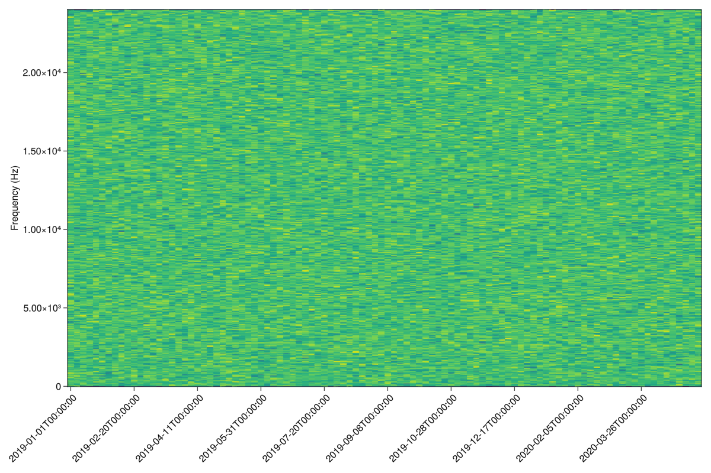

# LongTermSpectralAverage.jl

The package implements Long-Term Spectral Average (LTSA).

## Usage
```julia
using Dates
using LongTermSpectralAverage

starttimes = (DateTime(2019,1,1,0,0,0):Day(1):DateTime(2019,1,30,0,0,0))
xs = [randn(10000) for _ ∈ 1:length(starttimes)]
ltsa_plot(xs, starttimes; fs = 9600)
```
